# 자료구조

효율적으로 데이터를 관리하고 수정, 삭제, 탐색, 저장할 수 있는 데이터 집합

## 빅오 표기법

입력 크기에 대해 어떠한 알고리즘이 실행되는 데 걸리는 시간

# 선형 자료 구조

요소가 일렬로 나열되어 있는 자료 구조

## 연결 리스트

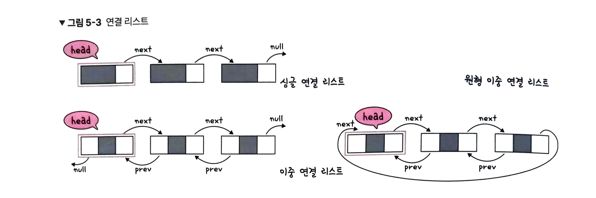

맨 앞의 노드를 head라고 하며 next 포인터, prev 포인터 여부, 연결 되는 방식에 따라 3가지 종류를 가지고 있다.

데이터 추가와 삭제를 많이 하는 것은 연결 리스트를 사용하면 좋다. 
(연결 리스트는 포인터를 다르게 연결만 해줘도 추가, 삭제가 가능하다.)

연결 리스트는 순차적 접근 방식이다.

## 배열

같은 타입의 변수들로 이루어져 있고, 크기가 정해져 있으며, 인접한 메모리 위치에 있는 데이터를 모아놓은 집합

중복을 허용하며 순서가 존재한다.

데이터 접근이 O(1)이고 추가와 삭제는 O(N)이므로 접근이 잦으면 배열을 사용하는 것이 좋다. (배열은 랜덤 접근)
(배열은 추가, 삭제 시에 데이터의 개수만큼 이  동시켜줘야 한다.)

### 순차적 접근과 랜덤 접근

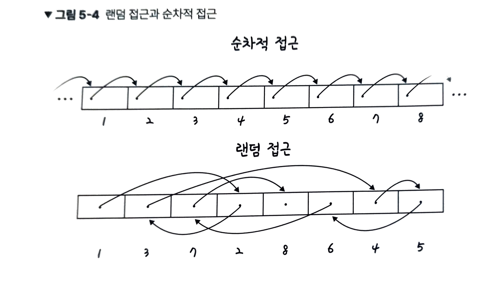

순차적 접근은 데이터가 저장된 순서대로 접근하는 것이고 랜덤 접근은 그 반대이다.

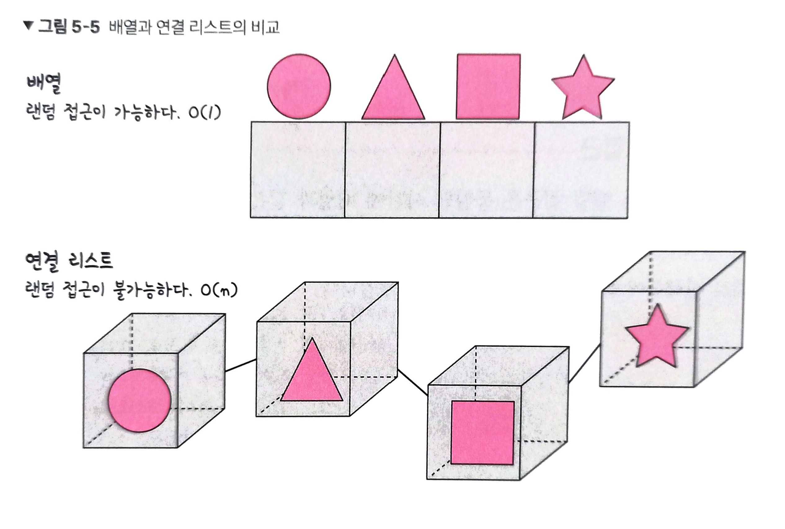

## 벡터

동적으로 요소를 할당할 수 있는 동적 배열

컴파일 시점에 개수를 모른다면 벡터를 써야 한다.

중복을 허용하고 순서가 있고 랜ㄴ덤 접근이 가능하다.

데이터 접근, 맨 뒤 에 요소 삭제, 추가는 O(1)이지만 맨 뒤가 아닌 요소를 다룰 경우 O(N)이다.

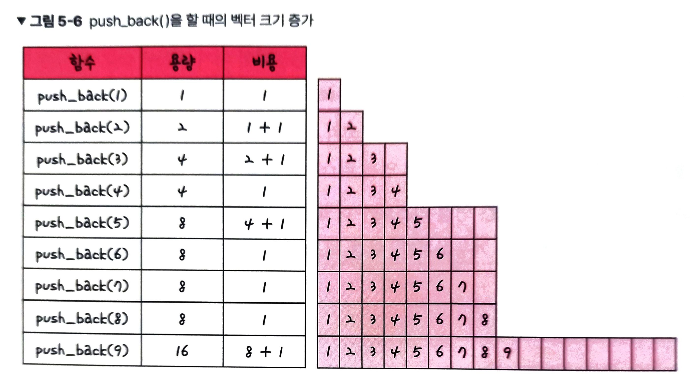

계산식을 보면 push_back했을 때 평균적으로 3이 드는데 이는 상수 시간에 가깝기에 O(1)이라고 볼 수 있다.

## 스택

LIFO (Last In First Out)

삽입, 삭제에 O(1)이 걸리며 탐색에 O(N)이 걸리게 된다.

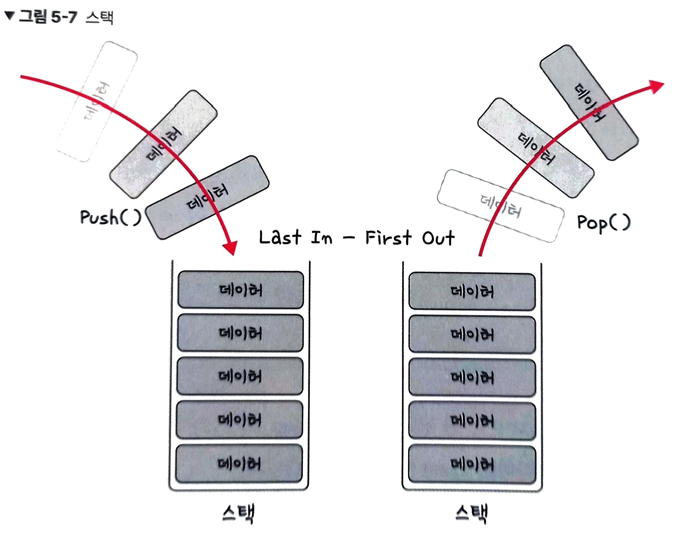
## 큐

FIFO (First In First Out)

삽입, 삭제에 O(1)이 걸리며 탐색에 O(N)이 걸리게 된다.

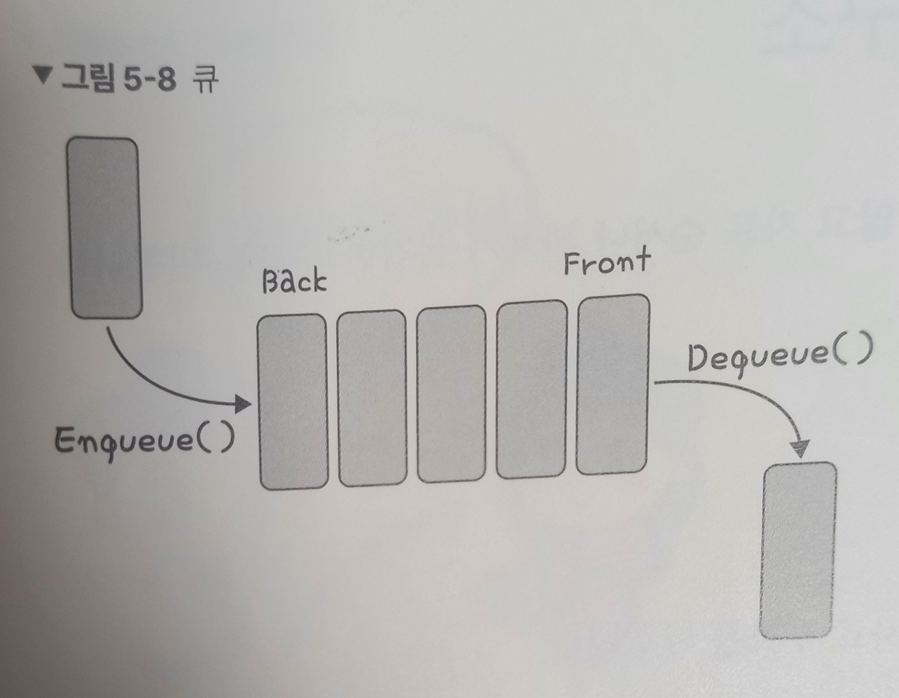

CPU 작업을 기다리는 프로세스, 스레드 행렬 또는 네트워크 접속을 기다리는 행렬, 너비 우선 탐색, 캐시 등에 사용됩니다.

# 비선형 자료 구조

일렬로 나열하지 않고 자료 순서나 관계가 복잡한 구조

## 그래프

정점과 간선으로 이루어진 자료 구조

### 정점과 간선 (vertex, edge)

어떤 곳에서 어떤 곳으로 간다고 할 때 그 위치를 vertex, 가는 길 자체를 edge 라고 한다.

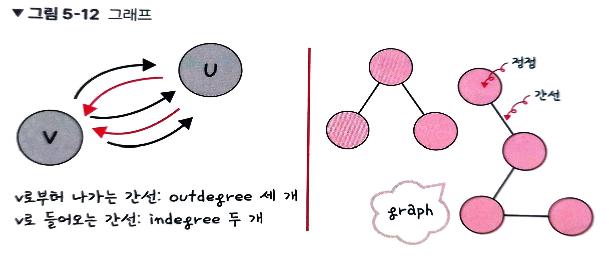

### 가중치

간선과 정점 사이에 드는 비용

## 트리

정점과 간선으로 이루어져 잇고 계층적 데이터의 집합

루트, 리프, 내부 노드의 종류가 존재하며 전체적인 구조를 트리 라고 한다.

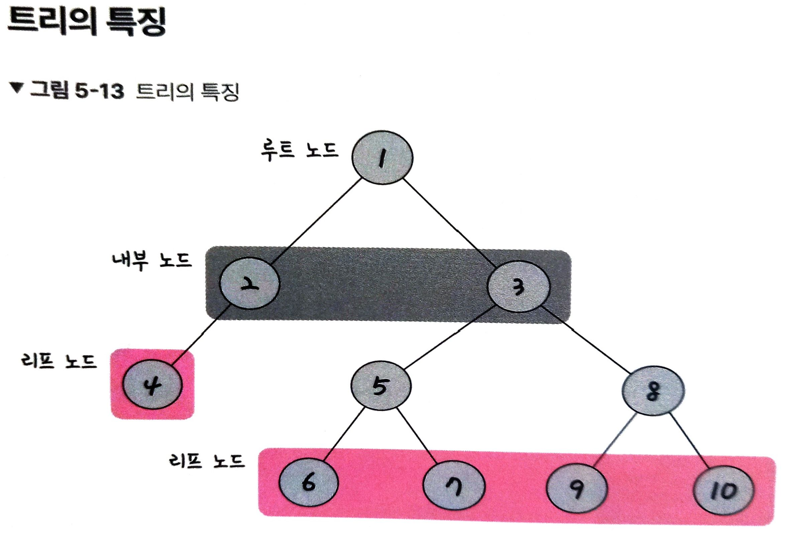

### 트리 용어

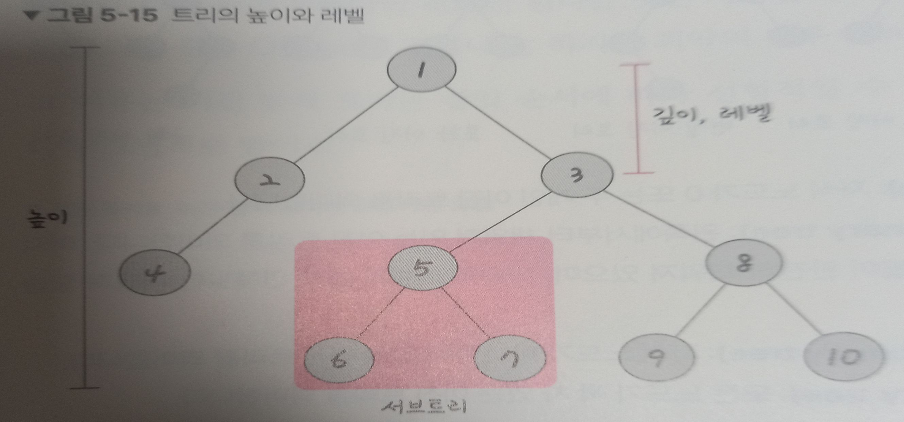
깊이 : 루트 노드부터 특정 노드까지 최단 거리로 갔을 때의 거리
높이 : 루트 노드부터 리프 노드까지 거리 중 가장 긴 거리
레벨 : 트리의 레벨은 주어지는 문제마다 조금씩 다르지만 보통 깊이와 같은 의미
서브트리 : 트리 내의 하위 집합

### 이진 트리

자식의 노드 수가 두 개 이하인 트리

### 이진 탐색 트리

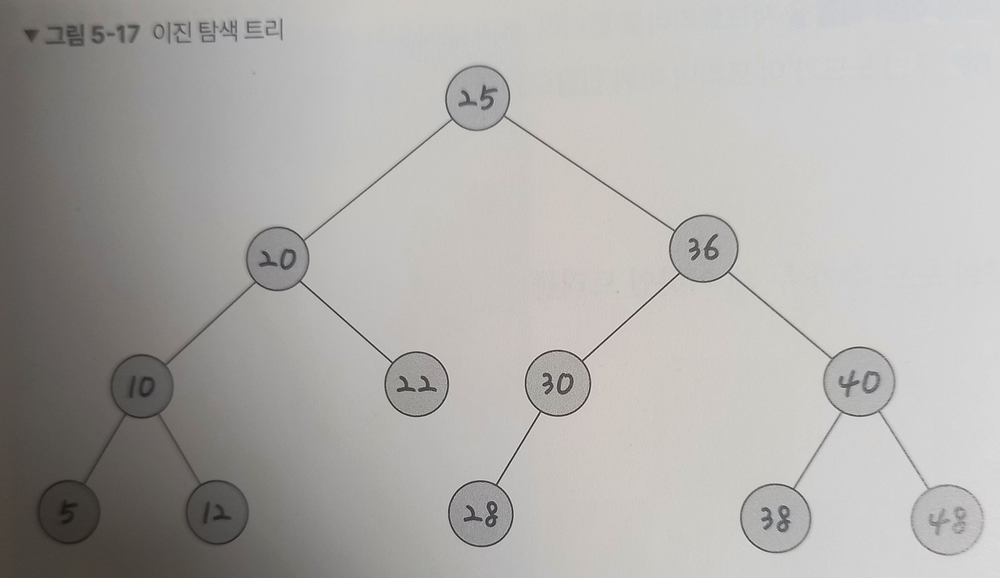

루트를 기준으로 모든 서브 트리들이 왼쪽에는 자기보다 작은 값들 오른쪽은 자기보다 큰 값들로 트리를 이루고 있는 트리

요소 찾는데 O(logN)이 걸리고 최악의 경우 O(N)이 걸린다.

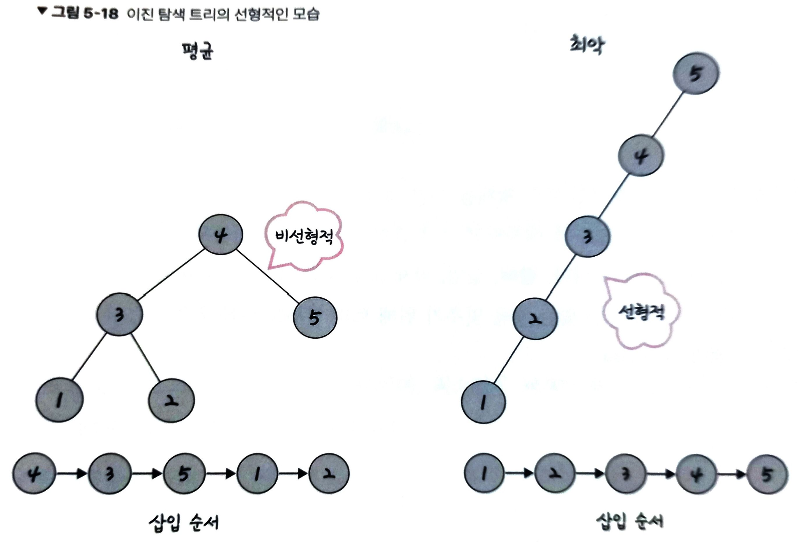

### AVL 트리

Adelson-Velsky and Landis tree

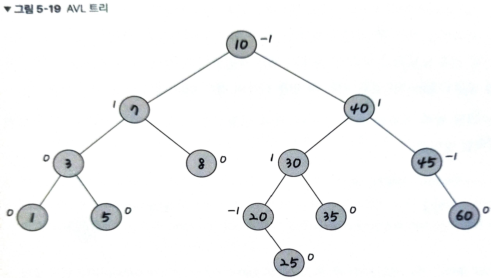

최악의 경우 선형적인 트리가 되는 것을 방지하고 스스로 균형을 잡는 이진 탐색 트리

두 자식 서브트리의 높이는 항상 최대 1만큼 차이 난다.

탐색, 삽입, 삭제 모두 O(logN)이며 삽입, 삭제 할때마다 균형이 안 맞는 것을 맞추기 위해 트리의 일부를 왼쪽 혹은 오른쪽으로 회전시키며 균형을 잡는다.

### Red Black 트리

탐색, 삽입, 삭제 모두 시간 복잡도가 O(logN)이다.

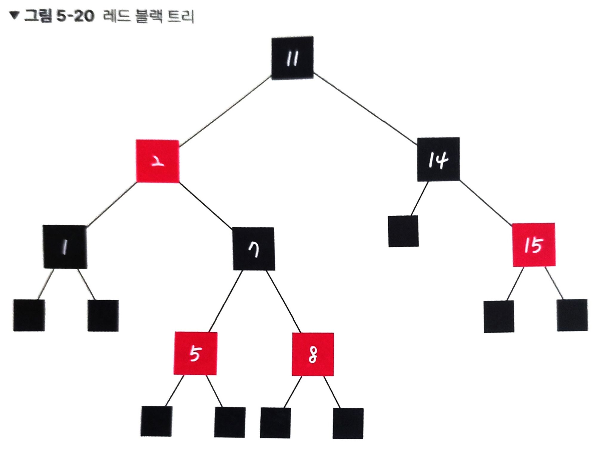

모든 리프 노드와 루트 노드는 블랙이고 어떤 노드가 레드이면 그 노드의 자식은 반드시 블랙이다 라는 규칙을 갖고 균형을 잡는다.

### 힙

이진 트리 기반의 자료 구조

최소 힙과 최대 힙 두 가지가 잇고 각각 루트가 가장 작거나 큰 특징을 갖고 있다.

하위 트리도 이러한 특징을 재귀적으로 갖고 있다.

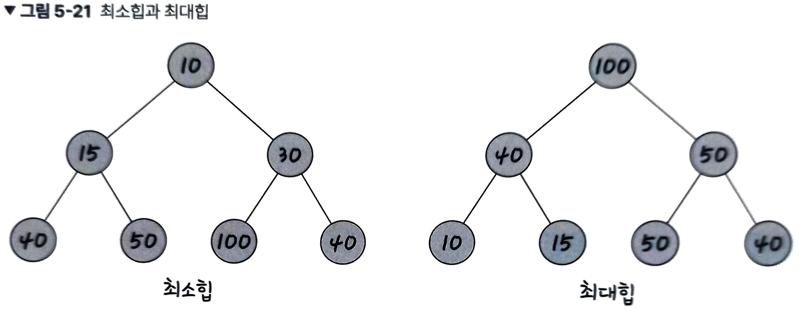

#### 최대힙의 삽입

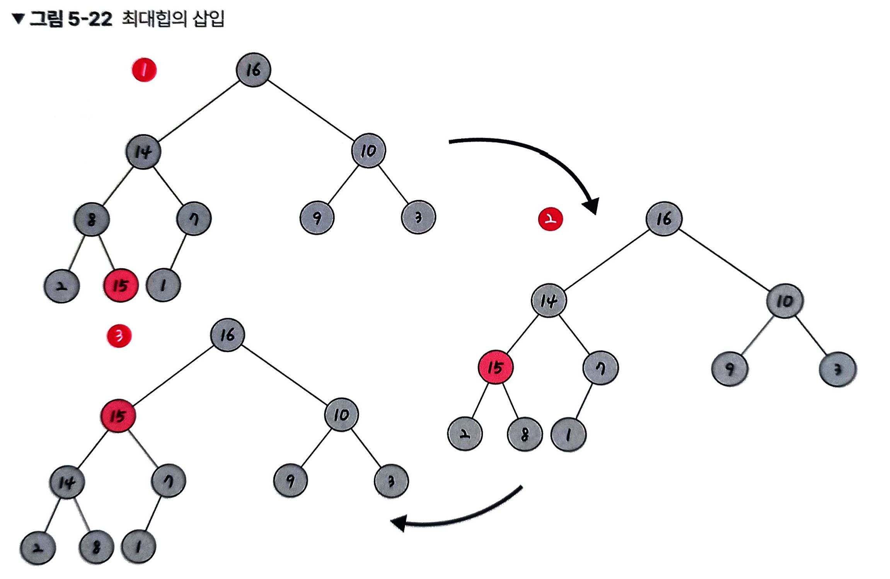

새로운 노드를 마지막 순서에 삽입 > 부모와 교환하며 위로 올라감

#### 최대힙의 삭제

루트 노드를 삭제하고 마지막 노드와 루트 노드를 스왑, 힙 조건에 맞게 조정한다.

## 우선순위 큐

우선순위가 높은 요소가 우선 순위가 낮은 요소보다 먼저 제공되는 자료 구조

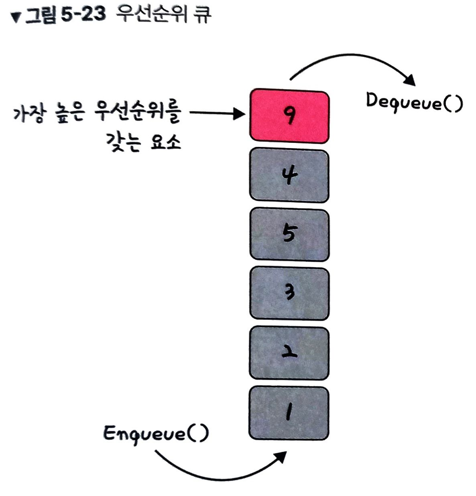

우선순위 큐는 힙을 기반으로 구현되며 여기에 우선순위만 넣으면 된다.

## Map

특정 순서에 따라 키와 매핑된 값의 조합으로 형성된 자료 구조

`{string : int}` 처럼 객체의 형태를 갖고 있으며 정렬을 보장하지 않는 unordered_map과 

정렬을 보장하는 map 두가지 종류가 존재한다.

해시 테이블을 구현할 때 사용된다.

## Set

특정 순서에 따라 고유한 요소를 저장하는 컨테이너이며, 중복되는 요소는 없고 오로지 희소한 값만 저장하는 자료 구조 이다.

## hash table

무한에 가까운 데이터들을 유한한 개수의 해시 값으로 매핑한 테이블이다.

삽입, 삭제, 탐색 시 평균적으로 O(1)의 시간 복잡도를 가지며 unordered_map으로 구현한다.

작은 크기의 캐시 메모리로도 프로세스를 관리하도록 할 수 있다.